# GBDA 对抗攻击 — Gradient-based Distributional Attack

本仓库实现了 **GBDA (Gradient-based Distributional Attack)**，一种基于梯度的分布对抗攻击方法，用于攻击文本分类模型。与传统的离散搜索方法（如 GCG）不同，GBDA 在连续松弛空间中通过标准梯度下降高效地生成对抗样本。

## 目录

- [GBDA 对抗攻击 — Gradient-based Distributional Attack](#gbda-对抗攻击--gradient-based-distributional-attack)
  - [目录](#目录)
  - [1. 项目概述](#1-项目概述)
  - [2. 背景：文本对抗攻击](#2-背景文本对抗攻击)
  - [3. GBDA 核心原理](#3-gbda-核心原理)
    - [3.1 Gumbel-Softmax 连续松弛](#31-gumbel-softmax-连续松弛)
    - [3.2 损失函数设计](#32-损失函数设计)
    - [3.3 温度退火策略](#33-温度退火策略)
    - [3.4 正则化的关键：为什么不用 KL 散度](#34-正则化的关键为什么不用-kl-散度)
  - [4. GCG vs GBDA](#4-gcg-vs-gbda)
  - [5. 项目架构](#5-项目架构)
    - [5.1 文本 Transformer 分类器](#51-文本-transformer-分类器)
    - [5.2 数据流 pipeline](#52-数据流-pipeline)
    - [5.3 GBDA 攻击器实现](#53-gbda-攻击器实现)
  - [6. 实验结果](#6-实验结果)
  - [7. 使用方式](#7-使用方式)
    - [环境配置](#环境配置)
    - [运行 Notebook](#运行-notebook)
    - [自定义攻击参数](#自定义攻击参数)
  - [8. 依赖和环境](#8-依赖和环境)
  - [9. 深入理解：GBDA 的设计选择](#9-深入理解gbda-的设计选择)
    - [为什么 GBDA 比 GCG 更高效？](#为什么-gbda-比-gcg-更高效)
    - [为什么参数初始化很重要？](#为什么参数初始化很重要)
    - [何时使用定向攻击 vs 非定向攻击？](#何时使用定向攻击-vs-非定向攻击)
  - [10. 参考与致谢](#10-参考与致谢)

---

## 1. 项目概述

**GBDA** 是一种在 **连续文本空间** 中生成对抗样本的攻击方法。其核心创新在于：

1. 对每个 token 位置维护一个**连续参数向量** $\theta_i \in \mathbb{R}^V$（$V$ = 词汇表大小）
2. 使用 **Gumbel-Softmax** 技巧实现可微分的离散采样，使梯度能够端到端传播
3. 通过 **梯度下降（Adam）** 优化 $\theta$，同时最小化分类损失和语义正则化项
4. **温度退火** 使采样分布从软概率逐渐"硬化"为离散 token

本项目的实验设置：

- **数据集**: AG News（4 类新闻主题：World / Sports / Business / Sci/Tech）
- **模型**: 自定义文本 Transformer（4 层编码器，4 头注意力，128 维嵌入）
- **攻击**: 非定向 GBDA 攻击，在 20 个样本上评估攻击性能

## 2. 背景：文本对抗攻击

对抗攻击的目标是对输入施加人类难以察觉的微小扰动，使模型产生错误的预测。在文本领域，对抗攻击面临独特挑战：

- **离散性**: 文本由离散的 token 组成，无法直接应用连续梯度方法
- **语义约束**: 对抗样本必须保持语义相似，否则攻击"无意义"
- **搜索空间大**: 词汇表通常有数万 token，组合搜索空间爆炸

传统方法如 **GCG (Greedy Coordinate Gradient)** 采用离散坐标贪心搜索，但存在效率问题。GBDA 通过连续松弛解决了这些问题。

## 3. GBDA 核心原理

### 3.1 Gumbel-Softmax 连续松弛

#### 3.1.1 核心问题：离散不可微

文本由离散的 token（单词）组成。假设词汇表有 10000 个词，每个 token 位置必须从这 10000 个词中**精确选择一个**——这种"非此即彼"的选择本质上是不可微的。

> **生活类比 — 选餐馆** 🍽️
>
> 你和朋友要决定今晚去哪家餐馆吃饭。词汇表里的每个词就像城市里的每家餐馆。
>
> - **离散方式（传统方法 / GCG）**：你们必须直接宣布"去川菜馆！"——这是一个干脆的决定，但无法微调。如果想试试粤菜，必须完全推翻重来，就像 GCG 枚举每家餐馆试吃一样低效。
>
> - **连续松弛方式（GBDA 的 Gumbel-Softmax）**：你们先不急着决定，而是讨论"辣的倾向 70%，清淡的倾向 20%，异国风的倾向 10%"。然后基于这个"软分布"做决策：
>   - 如果"想吃辣"的权重稍微增加，这个分布会平滑变化
>   - 实际去哪家仍用"抽签"决定（引入随机性），但抽签的**倾向性**是连续可调的
>   - 随着决策时间临近，你们逐渐"降温"——从"各种菜系都有可能"收缩到"就川菜了！"

#### 3.1.2 Gumbel-Softmax 如何工作

GBDA 对每个 token 位置 $i$ 维护一个 **logits 向量** $\theta_i \in \mathbb{R}^V$（$V$ = 词汇表大小），然后通过 **Gumbel-Softmax** 将离散采样"松弛"为连续可微操作。

整个过程可以分解为三步：

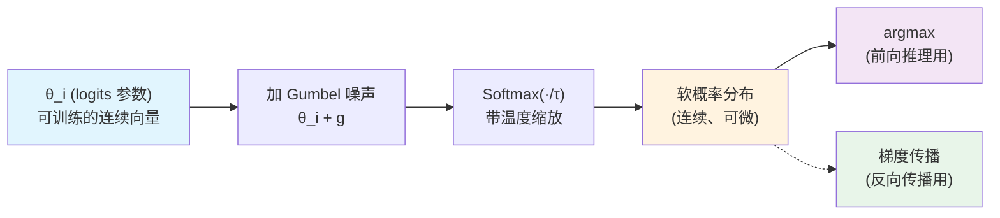

**为什么需要"加噪声 + Softmax"这么绕？**

这是因为我们需要一种"可微分的随机采样"——既能像采样一样做出多样化的选择，又能让梯度通过决策过程传回去。

##### 第 1 步：从 logits 到概率分布（不带噪声）

如果直接对 $\theta_i$ 做 Softmax，得到的是一个**确定性**的概率分布：

$$
P_{\theta_i}(k) = \frac{\exp(\theta_{i,k} / \tau)}{\sum_{j=1}^V \exp(\theta_{i,j} / \tau)}
$$

但这没有**随机性**——同样的 $\theta_i$ 总是产生同样的分布，无法"采样"。

##### 第 2 步：Gumbel-Max 技巧（离散采样）

Gumbel-Max 技巧告诉我们：要从分类分布 $P_{\theta_i}$ 中采样，等价于：

$$
\hat{k} = \arg\max_{k} \; (\theta_{i,k} + g_k), \quad g_k \sim \text{Gumbel}(0, 1)
$$

其中 Gumbel 噪声 $g_k$ 的 PDF 为 $f(x) = e^{-(x + e^{-x})}$。

> **🎲 Gumbel 噪声通俗理解**
>
> Gumbel 分布生成了一组"随机扰动"。这些扰动的特点是：
> - 均值为 0（不偏袒任何词）
> - 方差固定（噪声大小可控）
> - 极值分布（擅长模拟"最大值"的随机性）
>
> 就像给每个候选词一个小的随机"运势加成"，让原本分数差不多的词之间产生随机竞争。

##### 第 3 步：Softmax 松弛（Gumbel-Softmax）

Gumbel-Max 的 $\arg\max$ 仍然是不可微的。我们用 Softmax **近似**它：

$$
\text{GumbelSoftmax}_{\tau}(\theta_i)_k = \frac{\exp((\theta_{i,k} + g_k) / \tau)}{\sum_{j=1}^V \exp((\theta_{i,j} + g_j) / \tau)}
$$

这个公式的含义：

- **分子**：对每个词 $k$ 的分数 $(\theta_{i,k} + g_k)$ 取指数
- **分母**：对所有词的指数分数求和，做归一化
- **温度 $\tau$**：控制 Softmax 的"尖锐"程度

> **🎯 生活类比 — 选餐馆续**
>
> - **θᵢ**：你们对每家餐馆的内在偏好评分。川菜 90 分，粤菜 60 分，日料 50 分……
> - **gₖ**：朋友临时说"听说那家川菜馆最近换厨师了"——随机噪声影响了最终选择
> - **τ（温度）**：决策时的"纠结程度"
>   - **高温（τ=5）**："都行都行，随便哪家都可以"——分布平坦，什么都可能选
>   - **中温（τ=1）**："川菜不错，但粤菜也可以考虑"——有一定偏向但仍保留可能性
>   - **低温（τ=0.1）**："就去川菜！不用想了"——分布尖锐，几乎确定选最高分

#### 3.1.3 温度 $\tau$ 的视觉效果

温度参数 $\tau$ 控制着概率分布的"尖锐程度"：

```
                   高温 τ=5.0                        中温 τ=1.0                        低温 τ=0.1
                                                                                        
    ▲                                  ▲                                  ▲             
    |        ████                      |            ██                    |              
    |     ██████████                   |         ████████                 |        ██    
    |   ████████████████               |       ██████████████             |     ████████ 
    |  ████████████████████            |     ████████████████████          |   ██████████
    +───────────────────►              +───────────────────►              +──────────────►
     词A 词B 词C 词D 词E                 词A 词B 词C 词D 词E                 词A 词B 词C 词D 词E
                                                                                        
   分布平坦，几乎所有词              中等尖锐，最高分词汇          非常尖锐，几乎只有
   都有被选中的可能                  略占优势，其他仍有             最高分词汇会被选中
                                     被选中的机会                   
```

> **从优化角度理解温度的作用**：
>
> - **高温（$\tau \gg 1$）**：Softmax 输出接近均匀分布，梯度 $\partial \mathcal{L}/\partial \theta$ 分散到所有词汇上——探索阶段，发现哪些词可能有用
>
> - **低温（$\tau \ll 1$）**：Softmax 输出接近 one-hot，梯度只集中在少数词汇上——利用阶段，锁定最优词汇
>
> GBDA 采用**温度退火**：从高温开始（全面探索），逐步降至低温（精细锁定）。这就像先画草图再精修——先用宽笔刷勾勒轮廓，再换细笔刻画细节。

#### 3.1.4 Gumbel-Softmax 与 argmax 的关系

当温度 $\tau \to 0$ 时，Gumbel-Softmax 的行为趋近于离散的 Gumbel-Max 采样：

$$
\lim_{\tau \to 0} \text{GumbelSoftmax}_{\tau}(\theta_i)_k \to \text{one-hot}\left(\arg\max_k (\theta_{i,k} + g_k)\right)
$$

这个关系至关重要：

| $\tau$ | 行为 | 可微性 | 在 GBDA 中的角色 |
|--------|------|--------|-----------------|
| 大 ($\gg 1$) | 平滑、随机探索 | ✅ 完全可微 | 优化前期探索词汇空间 |
| 适中 ($\approx 1$) | 偏向高分词，仍有随机性 | ✅ 完全可微 | 优化中期逐步聚焦 |
| 小 ($\ll 1$) | 接近离散 one-hot | ⚠️ 梯度消失 | 优化后期锁定具体 token |
| $\to 0$ | 完全离散 argmax | ❌ 不可微 | 推理时评估攻击效果 |

#### 3.1.5 为什么 Gumbel-Softmax 可以微分？

这是理解 GBDA 的关键：

```
                    前向传播路径（正常计算）
    ┌──────────────────────────────────────────────────────────────────────────┐
    │  θ (参数) ──→ θ + g (加噪声) ──→ Softmax(·/τ) ──→ 软采样 ──→ 嵌入 ──→ 模型 ──→ 损失 │
    └──────────────────────────────────────────────────────────────────────────┘
         ↑                              ↑                              ↑
      可训练                        可微分的                       可微分的
                                                                              
                    反向传播路径（梯度流）
    ┌──────────────────────────────────────────────────────────────────────────┐
    │  θ ←── ∂L/∂θ ──← ∂L/∂(θ+g) ──← ∂L/∂Softmax ──← ∂L/∂嵌入 ──← ∂L/∂模型 ──← ∂L/∂损失 │
    └──────────────────────────────────────────────────────────────────────────┘
         ↑                              ↑
    ⚠️ g 被视为常数                Softmax 的雅可比矩阵
    ∂g/∂θ = 0                     完全可解析计算
```

**三步保证可微性**：

1. **噪声可分离**：Gumbel 噪声 $g_k$ 是独立采样的随机变量，在反向传播时被视为常数，$\frac{\partial g_k}{\partial \theta} = 0$，不阻断梯度

2. **Softmax 可微**：Softmax 函数 $\sigma(z)_k = e^{z_k} / \sum_j e^{z_j}$ 对输入 $z$ 有解析的雅可比矩阵：
   $$
   \frac{\partial \sigma(z)_k}{\partial z_i} = \sigma(z)_k (\delta_{ki} - \sigma(z)_i)
   $$
   这意味着梯度可以干净地穿过 Softmax 传播到 $\theta$

3. **端到端流动**：梯度从损失函数 $\mathcal{L}$ 出发，经过模型 → 嵌入 → Gumbel-Softmax，最终到达可训练参数 $\theta$，实现完整的端到端优化

> **🎯 生活类比 — 选餐馆终**
>
> 整个过程就像你们用"投票权重"来找餐馆：
>
> 1. **初始化**：每人给各家餐馆打分（$\theta$），一开始比较随机
> 2. **加噪声**：加入一些临时因素（有人想吃辣、有人想吃清淡的），让选择有些随机性
> 3. **软决策**：不直接定死，而是算出一个"去各家的概率分布"
> 4. **反馈**：试吃后根据满意度调整打分（**这就是梯度下降！**）
> 5. **退火**：随着时间推移，噪声逐渐减小，打分越来越确定
> 6. **最终锁定**：温度降到最低，选中最终餐馆
>
> 关键优势：每次调整打分时，**所有人都能从这次"试吃"中学到东西**，并通过调整分数来影响下次决策——这就是梯度传播！

### 3.2 损失函数设计

#### 3.2.1 总览：双目标优化的平衡艺术

GBDA 的优化目标包含两个相互制衡的部分——就像走钢丝，既要让模型犯错（攻击性），又不能改得面目全非（隐蔽性）：

$$
\mathcal{L} = \underbrace{-\text{CE}(f(\text{GumbelSoftmax}_\tau(\theta) \cdot E), \, y_{\text{true}})}_{\text{分类损失（攻击性）}} + \lambda \cdot \underbrace{(-\log P_\theta(y_{\text{orig}}))}_{\text{正则化项（隐蔽性）}}
$$

> **🎯 生活类比 — 修改一封推荐信 ✉️**
>
> 假设你想"攻击"一封大学推荐信，让招生官看走眼：
>
> - **原文**："小明是班上最优秀的学生，成绩优异，科研能力突出"
> - **目标**：让招生官误以为小明不适合录取（分类错误）
>
> **分类损失（攻击性）**：你想要大幅改动推荐信，让招生官给出差评。
> 比如改成："小明是班上最差的学生，经常迟到，作业不交"——攻击性拉满，但太明显了。
>
> **正则化项（隐蔽性）**：你需要推荐信看起来还像是原来的风格和内容。
> 比如只改一个词为："小明是班上还可以的学生，成绩优异，科研能力突出"——隐蔽，但可能骗不过招生官。
>
> **$\lambda$ 就是这两者的平衡旋钮**：
> - $\lambda=0$：只管攻击，改得面目全非（容易被发现）
> - $\lambda=\infty$：完全不改，攻击失败（没有效果）
> - $\lambda=\text{适中}$：只改关键几处，既骗过招生官，又不太起疑

#### 3.2.2 两个部分的相互作用

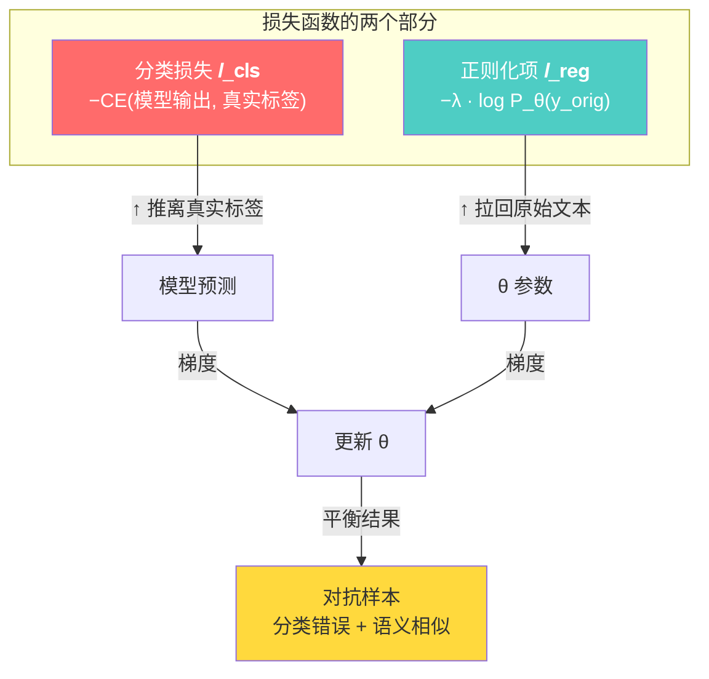

> **注意方向！** 分类损失和正则化项对 $\theta$ 的**梯度方向往往是相反的**：
>
> - 分类损失想让 $\theta$ 偏离原始 token 去"骗"模型
> - 正则化项想让 $\theta$ 靠近原始 token 去"保"语义
> - 两者的合力决定了对抗样本的最终形态

---

#### 3.2.3 分类损失（Classification Loss）— 攻击引擎 ⚔️

##### 非定向攻击（默认）

在非定向攻击中，我们不在乎模型预测成什么，只要求它**预测错误**：

$$
\mathcal{L}_{\text{cls}} = -\text{CE}(f(x'), \, y_{\text{true}})
$$

> **用具体数字理解**：
>
> 假设原始模型预测为"Sports"类的概率是 [0.01, 0.92, 0.05, 0.02]。
>
> - 原始交叉熵 $\text{CE}(y_{\text{true}}, \hat{y}) = -\log(0.92) \approx 0.083$（很小，模型很自信）
> - **负**交叉熵 $\mathcal{L}_{\text{cls}} = -0.083$（已经是负数了）
> - 优化器会**最小化** $\mathcal{L}_{\text{cls}}$，也就是说它要让交叉熵**最大化**
> - 对抗希望达到的效果：模型输出变成 [0.30, 0.10, 0.45, 0.15]，此时 $\text{CE} = -\log(0.10) \approx 2.30$，$\mathcal{L}_{\text{cls}} = -2.30$
> - 损失从 -0.083 降到 -2.30，模型对真实标签的置信度从 92% 降到 10%，预测变为 "Business"

##### 定向攻击

定向攻击则要求模型预测成**指定的目标类别**：

$$
\mathcal{L}_{\text{cls}} = \text{CE}(f(x'), \, y_{\text{target}})
$$

注意这里 **没有负号**——我们直接最小化目标类别的交叉熵，让模型对目标类别的置信度最大化。

##### 两种攻击的对比

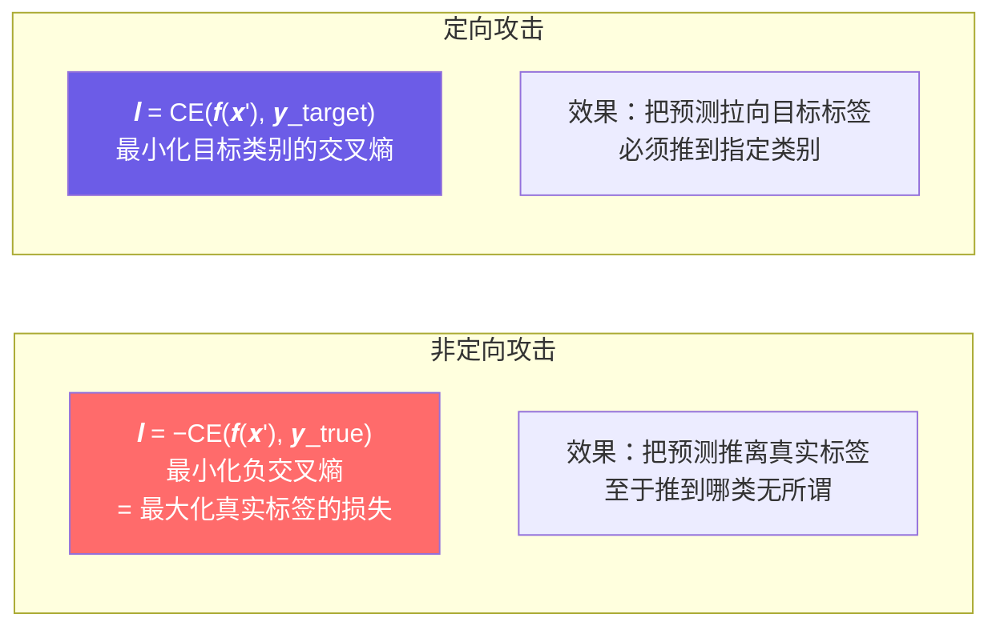

| 特性 | 非定向攻击 | 定向攻击 |
|------|-----------|---------|
| 损失公式 | $-\text{CE}(f(x'), y_{\text{true}})$ | $\text{CE}(f(x'), y_{\text{target}})$ |
| 优化方向 | 最大化真实标签损失 | 最小化目标标签损失 |
| 成功条件 | 预测 $\neq$ 真实标签 | 预测 $=$ 目标标签 |
| 难度 | 较容易（4 类中错 3 类都算成功） | 较难（必须精确命中目标类） |
| 所需扰动 | 通常更小 | 通常更大 |

> **🍽️ 选餐馆类比#2 — 选餐馆偏好**
>
> - **非定向攻击**："只要不是川菜馆，去哪家都行！"——你的朋友只知道自己不想吃辣，无所谓去哪家
> - **定向攻击**："我就要吃粤菜！"——目标明确，必须说服所有人去粤菜馆

---

#### 3.2.4 正则化项（Regularization）— 隐形斗篷 🎭

##### 为什么需要正则化？

如果没有正则化，GBDA 可以自由选择任何 token——结果可能生成语义完全不通的乱码。正则化项确保对抗样本在**词法层面**仍然类似原文。

##### 用负对数似然（NLL）实现

$$
\mathcal{L}_{\text{reg}} = -\log P_\theta(y_{\text{orig}}) = -\sum_{i=1}^{L} \mathbb{I}_{y_i \neq \text{PAD}} \cdot \log P_{\theta_i}(y_i)
$$

其中：

- $P_{\theta_i}(y_i) = \text{Softmax}(\theta_i / \tau)$：第 $i$ 个位置上对抗分布赋予原始 token $y_i$ 的概率
- $\mathbb{I}_{y_i \neq \text{PAD}}$：排除填充位（PAD token 没有语义，不需要约束）

> **💡 直观理解**
>
> 如果对抗分布 $P_\theta$ 在位置 $i$ 给原始词 $y_i$ 的概率是 0.8：
> - $\log(0.8) \approx -0.22$
> - $\mathcal{L}_{\text{reg}} = -(-0.22) = 0.22$（小损失，语义保留好）
>
> 如果对抗分布给原始词的概率只有 0.05：
> - $\log(0.05) \approx -3.0$
> - $\mathcal{L}_{\text{reg}} = -(-3.0) = 3.0$（大损失，语义偏离多）
>
> **优化器最小化 $\mathcal{L}_{\text{reg}}$**，就是迫使对抗分布尽量给原始词高概率。

##### 带掩码的逐位置计算

```
位置:   0       1       2       3       4       5       6  ...
原始词: [CLS]   the    cat    sat    on    [PAD]  [PAD] ...
         ↓       ↓       ↓       ↓       ↓       ↓       ↓
对抗概率: 0.95    0.80    0.60    0.70    0.85    0.99    0.99   ← Softmax(θ/τ) 对原始词的概率
掩码:    1       1       1       1       1       0       0     ← PAD 位置掩掉
         ↓       ↓       ↓       ↓       ↓
NLL:    -log0.95 -log0.80 -log0.60 -log0.70 -log0.85  (忽略)  (忽略)
        = 0.05   = 0.22   = 0.51   = 0.36   = 0.16

                 总 NLL = 0.05 + 0.22 + 0.51 + 0.36 + 0.16 = 1.30
                 平均 NLL = 1.30 / 5 = 0.26
```

> **🍽️ 选餐馆类比#3 — 改菜单**
>
> 你和朋友去了一家川菜馆（原文），但你想**偷偷改变主菜的口味**（攻击）：
>
> - **无正则化**：直接把所有菜全换成粤菜——新菜单和原来完全不同，服务员一眼就看出不对劲
> - **正则化太小（$\lambda$ 小）**：大部分菜没变，但把 3 道主菜换了换——看着有点奇怪，但服务员未必注意
> - **正则化适中（$\lambda$ 适中）**：只把"水煮鱼"换成"酸菜鱼"——辣度变了但看起来还是川菜，服务员没发现
> - **正则化太大（$\lambda$ 大）**：最后所有菜都还是原来的——攻击失败
>
> 正则化项 NLL 就是对每道菜"保留原样"的程度打分，$\lambda$ 则是"服务员有多警觉"。

#### 3.2.5 超级参数 $\lambda$：攻击性与隐蔽性的天平

$\lambda$ 是 GBDA 最重要的超参数之一，控制两个目标之间的权衡：

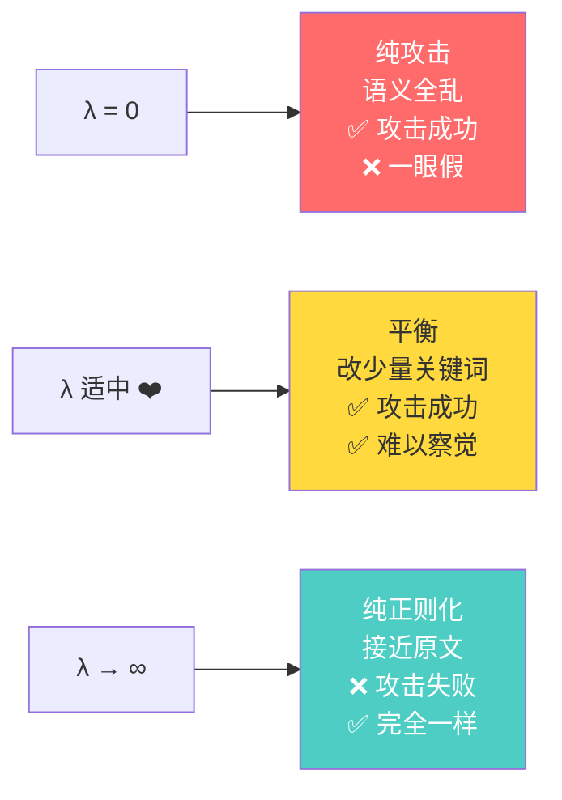

**实际效果示例**（以 AG News 一条体育新闻为例）：

```
原文: "roger federer wins wimbledon final in straight sets"

λ=0.000 (纯攻击):
  → "quantum flux capacitor modulation spectral"    ✓ 攻击成功  ✗ 语义全乱

λ=0.001 (激进):
  → "roger federer loses wimbledon final in straight sets"  ✓ 攻击成功  ⚠️ 改了关键动词

λ=0.005 (推荐):
  → "roger federer wins wimbledon final in three sets"  ✓ 攻击成功  ✓ 看起来合理

λ=0.050 (保守):
  → "roger federer wins wimbledon final in straight sets"  ✗ 攻击失败  ✓ 和原文基本一样

λ→∞:
  → "roger federer wins wimbledon final in straight sets"  ✗ 攻击失败  ✓ 完全相同
```

> **调参建议**：
>
> - 从 $\lambda=0.01$ 开始尝试
> - 如果攻击成功但对抗文本读起来不通顺 → **增大** $\lambda$
> - 如果攻击失败（模型仍预测正确） → **减小** $\lambda$
> - 好的 $\lambda$ 值通常在 0.001 ~ 0.05 之间

---

#### 3.2.6 与 Gumbel-Softmax 的完整数据流

将 3.1 和 3.2 串联起来，看看一次优化步骤中数据如何流动：

```
输入                                                     输出
文本 → tokenizer.encode → input_ids                      对抗文本 ← tokenizer.decode ← adv_ids
                            ↓                                                              ↑
                       初始化 θ ← 原始 token logits=5.0 + ε                                |
                            ↓                                                              |
                   ┌─── 循环开始 (step=0..max_steps) ────────────────────────────────┐      |
                   │                                                                │      |
                   │  θ ──→ θ + g (Gumbel 噪声) ──→ GumbelSoftmax(·/τ) ──→ 软采样  │      |
                   │                                                                │      |
                   │  软采样 @ E (嵌入矩阵) ──→ adv_emb ──→ model.forward_from_emb   │      |
                   │                                                                │      |
                   │  模型输出 logits ──→ 分类损失 ℓ_cls                             │      |
                   │        ↓                                                        │      |
                   │  Softmax(θ/τ) ──→ 正则化损失 ℓ_reg                              │      |
                   │        ↓                                                        │      |
                   │  ℓ_total = ℓ_cls + λ · ℓ_reg                                    │      |
                   │        ↓                                                        │      |
                   │  反向传播 → θ.grad → optimizer.step() → 更新 θ                  │      |
                   │        ↓                                                        │      |
                   │  θ.argmax → 离散 token → model → 预测正确? → 成功则提前退出      │      |
                   └────────────────────────────────────────────────────────────────┘      |
                            ↓                                                              |
                       保存最佳 θ ──→ θ.argmax → adv_ids ──────────────────────────────────┘
```

> **一条路走到黑——可微端到端**：
>
> 整个循环中，**每一步都是可微的**。从损失函数到 $\theta$ 之间没有任何"台阶"阻断梯度的流动。这就是 GBDA 的核心优势——用标准的梯度下降解决了一个看似需要离散搜索的问题。

### 3.3 温度退火策略

#### 3.3.1 为什么需要温度退火？

Gumbel-Softmax 的温度 $\tau$ 直接决定了攻击优化的行为和效果。但问题在于：**没有一个固定的温度值能同时满足优化的所有阶段**。

> **🎯 生活类比 — 雕刻大理石像 🗿**
>
> 想象一位雕刻师要在一块大理石中雕出一座人像：
>
> - **高温（$\tau$ 大）** ≈ 用大锤粗凿。快速去除大块废料，探索石材的整体形状，但无法精细刻画
> - **低温（$\tau$ 小）** ≈ 用刻刀精修。可以雕出细腻的五官和纹理，但如果一开始就用刻刀，几天也雕不完
>
> 聪明的雕刻师会**先用大锤，再用刻刀**。这就是温度退火的精髓——从粗到精，从探索到利用。

**固定温度的致命问题**：

| 如果全程… | 结果 |
|-----------|------|
| **高温固定**（$\tau=2.0$） | 分布始终平坦，停留在"模糊探索"阶段——每个位置同时考虑大量词汇，梯度分散，无法收敛到具体 token |
| **低温固定**（$\tau=0.1$） | 分布过早硬化，梯度仅集中在极少数词汇——一旦选错方向就很难调整，极易陷入局部最优 |
| **中温固定**（$\tau=1.0$） | 两头不讨好——既没有高温的探索广度，也没有低温的收敛精度 |

**退火**（Annealing）通过让温度**随时间动态递减**，使优化过程自然地从"全面探索"过渡到"精细利用"。

#### 3.3.2 指数衰减调度公式

GBDA 采用**指数衰减**调度：

$$
\tau_t = \max\left(\tau_{\min}, \; \tau_{\text{init}} \cdot \left(\frac{\tau_{\min}}{\tau_{\text{init}}}\right)^{\frac{t}{T}}\right)
$$

其中：

- $\tau_{\text{init}}$: 初始温度（通常 2.0~5.0）
- $\tau_{\min}$: 最低温度（通常 0.01~0.5）
- $t$: 当前优化步数
- $T$: 最大优化步数
- $\max(\cdot)$: 确保温度不低于 $\tau_{\min}$

这个公式的妙处在于：温度按**指数曲线**下降，在早期快速下降（快速通过不稳定的高温区），在晚期缓慢趋近最小值（在低温区精调）。

#### 3.3.3 温度退火曲线可视化

以 $\tau_{\text{init}}=2.0$, $\tau_{\min}=0.1$, $T=200$ 为例：

```
温度 τ
  │
2.0│  ╱
  │ ╱        探索阶段
  │╱              ↓ 梯度在大量词汇间流动，更新幅度大
1.5│               ← 中期过渡
  │                ↓ 分布逐渐聚焦，梯度向高分词汇集中
  │
1.0│
  │
  │
0.5│                利用阶段
  │                 ↓ 分布接近 hard，梯度锁定少数词汇
0.1│                  ═══════════════════════════
  │
  └──────────────────────────────────────────────► 步数 t
   0        50        100       150       200

阶段划分：
  [0────50)  探索期    τ ≈ 2.0→0.6   梯度分散，全面搜索词汇空间
  [50───120)  过渡期   τ ≈ 0.6→0.2   梯度聚焦，逐步锁定词汇
  [120──200]  利用期   τ ≈ 0.2→0.1   接近离散，精调最终选择
```

> **关键观察**：
>
> 退火曲线的形状（而非仅仅是终点）对攻击效果有显著影响：
>
> - **衰减太快**：过早硬化，错过好的词汇组合，攻击可能失败
> - **衰减太慢**：长期停留在模糊分布中，浪费大量步数
> - **GBDA 的指数调度**在实践中有良好的平衡——在约前 25% 步数中将温度降至中值，剩余 75% 步数用于精细调整

#### 3.3.4 温度如何影响 Gumbel-Softmax 分布

回顾 Gumbel-Softmax 公式：

$$
\text{GumbelSoftmax}_{\tau}(\theta_i)_k = \frac{\exp((\theta_{i,k} + g_k) / \tau)}{\sum_{j=1}^V \exp((\theta_{i,j} + g_j) / \tau)}
$$

温度 $\tau$ 出现在分母中——它**缩放**了整个 logits 向量（包括 Gumbel 噪声）：

```mermaid
flowchart LR
    subgraph 高温 τ≫1
        H1["θ_i + g"] --> H2["÷τ (缩得很小)"]
        H2 --> H3["exp(很小) 各值差别不大"]
        H3 --> H4["Softmax 输出接近均匀分布"]
        H4 --> H5["← 每个词都有机会被选中"]
    end

    subgraph 低温 τ≪1
        L1["θ_i + g"] --> L2["÷τ (放得很大)"]
        L2 --> L3["exp(很大) 最大值主导一切"]
        L3 --> L4["Softmax 输出接近 one-hot"]
        L4 --> L5["← 只有最高分词汇被选中"]
    end

    style H5 fill:#fff3e0
    style L5 fill:#f3e5f5
```

**数学视角看温度的作用**：

令 $z_k = \theta_{i,k} + g_k$，则 Gumbel-Softmax 的输出为：

$$
p_k = \frac{e^{z_k / \tau}}{\sum_j e^{z_j / \tau}}
$$

考察两个候选词 $a$ 和 $b$ 的概率比值：

$$
\frac{p_a}{p_b} = \exp\left(\frac{z_a - z_b}{\tau}\right)
$$

- **$\tau$ 很大时**：$z_a - z_b$ 被 $\tau$ 压缩，比值接近 1 → 分布均匀
- **$\tau$ 很小时**：$z_a - z_b$ 被 $\tau$ 放大，比值指数级增大 → 高分词压倒性胜出

> **🎯 用数字理解**：
>
> 假设 $\theta_{i,\text{cat}} = 2.0$, $\theta_{i,\text{dog}} = 1.8$，忽略噪声：
>
> | $\tau$ | $p_{\text{cat}} / p_{\text{dog}}$ | 含义 |
> |--------|-----------------------------------|------|
> | 2.0 | $e^{0.2/2.0} = e^{0.1} \approx 1.11$ | cat 只有 11% 优势，狗被选中的概率也很大 |
> | 1.0 | $e^{0.2/1.0} = e^{0.2} \approx 1.22$ | cat 有 22% 优势，狗仍有竞争力 |
> | 0.5 | $e^{0.2/0.5} = e^{0.4} \approx 1.49$ | cat 接近 50% 优势，狗开始落后 |
> | 0.1 | $e^{0.2/0.1} = e^{2} \approx 7.39$ | cat 比狗高出 7 倍，几乎锁定 |

#### 3.3.5 退火过程中的梯度行为

温度退火不仅改变采样分布，也深刻影响梯度的流动：

**梯度 $\frac{\partial \mathcal{L}}{\partial \theta}$ 的规模与温度的关系**：

$$
\frac{\partial \mathcal{L}}{\partial \theta_i} \propto \frac{1}{\tau} \cdot (\text{采样结果} - \text{Softmax 概率})
$$

> **🎯 生活类比 — 手电筒调焦 🔦**
>
> - **高温（$\tau$ 大）** = 散光模式：光线散射范围广，但每个点的亮度弱（梯度分散，更新幅度小）
> - **低温（$\tau$ 小）** = 聚光模式：光线集中在一点，亮度强（梯度集中，更新幅度大——但范围窄）
>
> 退火就是从散光到聚光的渐变过程。

| 阶段 | 温度 | 梯度行为 | 对优化的影响 |
|------|------|---------|------------|
| **探索期** | $\tau \gg 1$ | 梯度平滑、分布在大量词汇上 | 避免陷入局部最优，发现"哪些词汇区域可能有潜力" |
| **过渡期** | $\tau \approx 1$ | 梯度向高分词汇聚集，较不稳定 | 核心优化阶段——逐步缩小候选范围 |
| **利用期** | $\tau \ll 1$ | 梯度集中在极少数词汇，数值增大 | 精调锁定——选择最终 token |

**梯度消失风险**（低温陷阱）：

当温度极低时，Softmax 退化为 one-hot，非选中位置的梯度趋于 0：

$$
\frac{\partial \text{Softmax}(z/\tau)_k}{\partial z_i} \xrightarrow{\tau \to 0} 0 \quad (\text{当 } k \neq i)
$$

这意味着在低温下，模型**几乎无法再切换词汇**——所有梯度信息都集中在已选中的词汇上。这就是为什么退火不能一开始就低温，必须在高温区完成探索。

#### 3.3.6 退火调度对比：指数 vs 线性 vs 余弦

GBDA 默认使用指数衰减，但其他调度策略也值得了解：

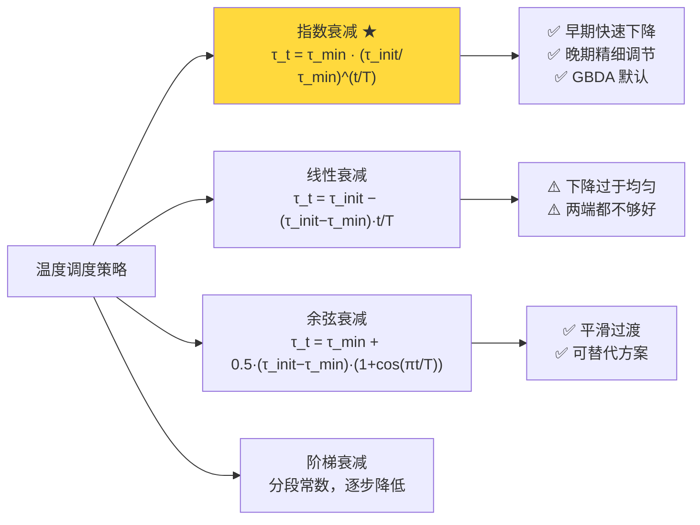

```
温度 τ
  │
  │ 指数 ────  线性 ═══  余弦 ═╤═
2.0│
  │   ╱
  │  ╱              ═══════════
  │ ╱    ═══      ╱
  │╱  ╱      ═══╱    ═══
  │   ╱          ╱
  │              ╱
0.1│══════════════════════════════
  │
  └──────────────────────────► 步数
   0                   200
```

| 调度 | 特点 | 适用场景 |
|------|------|---------|
| **指数衰减 ✅** | 早期快速降温 + 晚期缓慢逼近 | GBDA 默认推荐，平衡性好 |
| 线性衰减 | 全程均匀下降，两端表现中庸 | 简单基线，一般不推荐 |
| 余弦衰减 | S 形平滑过渡，中期变化最快 | 可替代方案，有时效果更好 |
| 阶梯衰减 | 分段常数，实现简单但不够平滑 | 调试分析时使用 |

#### 3.3.7 退火超参数调优指南

GBDA 中三个退火相关超参数：

| 参数 | 默认值 | 范围 | 调大效果 | 调小效果 |
|------|--------|------|---------|---------|
| $\tau_{\text{init}}$ (初始温度) | 2.0 | 1.0~5.0 | 探索更充分，收敛更慢 | 快速收敛，可能陷入局部最优 |
| $\tau_{\min}$ (最低温度) | 0.1 | 0.01~0.5 | 最终分布"较软"，离散性差 | 最终分布接近 one-hot，可能震荡 |
| $T$ (最大步数) | 200 | 50~500 | 退火更缓慢，精度更高 | 退火仓促，可能未收敛 |

**调参经验法则**：

```
问题：攻击成功率低
  → 增大 τ_init (2.0 → 3.0~5.0)，让探索更充分
  → 增大 T (200 → 300~500)，给退火更多时间

问题：对抗文本读起来不通顺
  → 减小 τ_min (0.1 → 0.05)，让最终分布更"硬"
  → 确保 T 足够大，分布有足够时间收敛

问题：攻击不稳定/每次结果差异大
  → 减小 τ_init (2.0 → 1.5)，减少随机探索范围
  → 增大 τ_min (0.1 → 0.2)，避免梯度消失
```

> **🍽️ 选餐馆类比#4 — 温度退火续**
>
> 回到选餐馆的类比。你们在不同时间点的决策方式：
>
> - **$\tau_{\text{init}} = 5.0$（高温）**：周一就开始讨论，"嘿，要不这周末把全城所有餐馆都考虑一下？日料、川菜、粤菜、西餐……"——什么都可以，完全开放探索
>
> - **$\tau = 2.0$（中高温）**：周三缩小范围，"排除掉泰国菜和印度菜吧，有人不爱吃"——逐步排除选项
>
> - **$\tau = 1.0$（中温）**：周五基本达成一致，"应该在川菜和粤菜之间选一个"——范围大幅缩小
>
> - **$\tau = 0.5$（中低温）**：周六晚上，"川菜吧？有点想吃辣"——倾向已经很明显
>
> - **$\tau_{\min} = 0.1$（低温）**：周日出门前，"就那家川菜馆了，走！"——决策锁定，不再更改
>
> **退火的核心思想**：不要在一开始就锁死选项，给探索留出空间；但也不要到最后一刻还在犹豫不决。

### 3.4 正则化的关键：为什么不用 KL 散度

#### 3.4.1 一个看似合理的直觉

在设计正则化项时，我们的目标是让对抗分布 $P_\theta$ **接近**原始 token 序列 $y_{\text{orig}}$。一个非常自然的想法是使用 **KL 散度**（Kullback-Leibler Divergence）来衡量两个分布之间的"距离"：

$$
\text{KL}(P_\theta \parallel Q) = \sum_{k=1}^{V} P_\theta(k) \log \frac{P_\theta(k)}{Q(k)}
$$

其中 $Q$ 是原始 token 的分布。既然原始 token $y_{\text{orig}}$ 是确定的离散值，直觉上可以用 **one-hot 分布**来表示它：

$$
Q = \text{one-hot}(y_{\text{orig}})
$$

于是正则化项变为：

$$
\mathcal{L}_{\text{reg}} = \text{KL}(P_\theta \parallel \text{one-hot}(y_{\text{orig}}))
$$

> **🎯 生活类比 — 考试估分 🧑‍🎓**
>
> 想象你刚考完试，想估算自己的分数。
>
> - **实际分数**（原始 token $y_{\text{orig}}$）：95 分——确定的、已知的值
> - **你的估计分布**（$P_\theta$）：你说 "90~95 分的概率 60%，95~100 的概率 40%"
>
> KL 散度就是在衡量：你的估计分布和"实际分数"这个确定值之间的差距。看起来没有问题，对吧？
>
> 但问题来了——**你的估算方式"假设"了实际分数的概率分布是 100% 集中在 95 分**。
> 如果有一个分数段（比如 60 分以下）从来没出现过，你就要计算 $\log(0)$……

#### 3.4.2 KL 散度在这里为什么是错的？ 

**直接原因：数学上的 NaN 灾难**

将 $Q = \text{one-hot}(y_{\text{orig}})$ 代入 KL 散度公式：

$$
\text{KL}(P_\theta \parallel \text{one-hot}(y)) = \sum_{k=1}^{V} P_\theta(k) \log \frac{P_\theta(k)}{\mathbb{I}_{k=y}}
$$

展开后发现这个表达式在 $k \neq y$ 时分子分母都出问题：

$$
\log \frac{P_\theta(k)}{\mathbb{I}_{k=y}} = 
\begin{cases}
\log \frac{P_\theta(y)}{1} = \log P_\theta(y) & \text{当 } k = y \\
\log \frac{P_\theta(k)}{0} = \log(\infty) = \infty & \text{当 } k \neq y
\end{cases}
$$

由于 $k \neq y$ 时 $\mathbb{I}_{k=y} = 0$，分母为零导致 $\log(\infty)$。

但结果还不止于此——需要注意 KL 散度的标准定义是 $Q$ 在分子位置：

$$
\text{KL}(Q \parallel P_\theta) = \sum_{k=1}^{V} Q(k) \log \frac{Q(k)}{P_\theta(k)}
$$

把 $Q = \text{one-hot}(y)$ 代入：

$$
\text{KL}(\text{one-hot}(y) \parallel P_\theta) = \sum_{k=1}^{V} \mathbb{I}_{k=y} \log \frac{1}{P_\theta(k)} = \log \frac{1}{P_\theta(y)} = -\log P_\theta(y)
$$

这个实际上是**负对数似然**！所以问题出在很多人在实现时**搞反了方向**，写了 $\text{KL}(P_\theta \parallel \text{one-hot})$，然后 $P_\theta(k) \cdot \log(P_\theta(k) / 0)$ 产生了 NaN。

> **💥 直观演示：一个具体例子**
>
> 假设词汇表有 5 个词 `["the", "cat", "dog", "sat", "mat"]`，原始 token 是 "cat" (索引 1)：
>
> ```
> Softmax(θ/τ) 输出 P_θ:
>   the: 0.05    cat: 0.80    dog: 0.10    sat: 0.03    mat: 0.02
>
> one-hot(y_orig):
>   the: 0       cat: 1       dog: 0       sat: 0       mat: 0
>
> 计算 KL(P_θ ‖ one-hot):
>   the: 0.05 × log(0.05 / 0) = 0.05 × log(∞) = NaN    ← 崩溃!
>   cat: 0.80 × log(0.80 / 1) = 0.80 × (-0.22) = -0.18
>   dog: 0.10 × log(0.10 / 0) = 0.10 × log(∞) = NaN    ← 崩溃!
>   ...
>
> 反向传播时：NaN 传播到所有参数 → 整个训练瞬间失效
> ```

#### 3.4.3 换个方向：KL(one-hot ‖ P_θ) 等价于 NLL

那如果方向反过来呢？

$$
\text{KL}(\text{one-hot}(y) \parallel P_\theta) = \sum_{k=1}^{V} \mathbb{I}_{k=y} \cdot \log \frac{1}{P_\theta(k)} = -\log P_\theta(y)
$$

这确实有定义——但它就是**负对数似然（NLL）**，只是换了个名字！所以没必要绕 KL 散度这个弯。

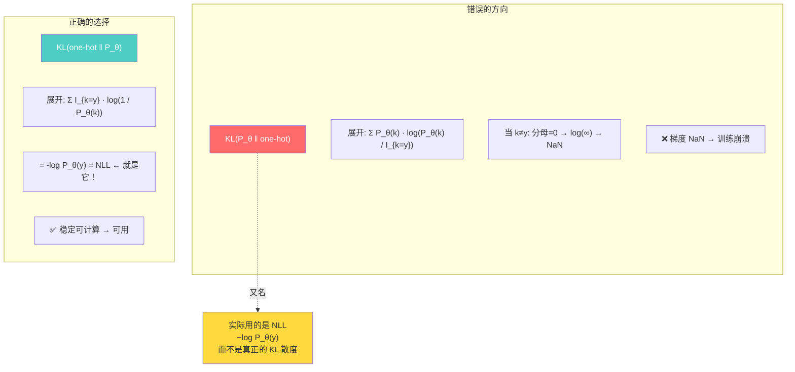

**为什么很多人（包括早期论文）会掉进这个坑？**

1. **KL 散度直觉太强**："最小化两个分布的距离"听起来就是正则化的完美目标
2. **符号歧义**：$\text{KL}(P \parallel Q)$ 和 $\text{KL}(Q \parallel P)$ 方向不同，结果天差地别
3. **连续分布习惯**：在连续空间（如图像攻击）中，KL 散度的两个方向都稳定可用。但离散文本的 one-hot 分布有严格为零的概率质量，导致问题
4. **代码实现错误**：PyTorch 的 `F.kl_div` 默认是用 $\text{KL}(P \parallel Q)$ 且要求 $Q$ 取 log。如果直接喂 $P_\theta$ 和 one-hot，会静默得到 NaN

#### 3.4.4 NLL vs KL 的深入对比

```mermaid
flowchart LR
    subgraph NLL 负对数似然
        NLL1["−log P_θ(y_orig)"]
        NLL2["只关心原始 token 位置的<br/>对抗分布概率"]
        NLL3["✅ 所有项都有定义<br/>✅ 梯度稳定<br/>✅ 计算高效"]
    end
    subgraph KL 散度（错误方向）
        KL1["KL(P_θ ‖ one-hot)"]
        KL2["同时考虑所有词汇位置<br/>包括 never-used 项"]
        KL3["❌ log(0) = -∞ 导致 NaN<br/>❌ 训练崩溃<br/>❌ 无法使用"]
    end

    style NLL1 fill:#4ecdc4,color:#fff
    style NLL3 fill:#e8f5e9
    style KL1 fill:#ff6b6b,color:#fff
    style KL3 fill:#ffebee
```

| 对比维度 | NLL $- \log P_\theta(y)$ | KL（错误方向） |
|----------|-------------------------|----------------|
| **计算范围** | 仅原始 token 一个位置 | 整个词汇表 $V$ 个位置 |
| **数值稳定性** | ✅ $P_\theta(y) > 0$ 保证有定义 | ❌ 零分母导致 $\log(0)$ |
| **梯度质量** | ✅ 稳定、有意义 | ❌ NaN 传播到所有参数 |
| **计算代价** | $O(1)$ 每次位置 | $O(V)$ 每次位置（词汇表求和） |
| **语义解释** | "原始 token 在对抗分布下有多大概率" | "两个分布的整体距离"（虽然算不了） |

> **🎯 生活类比 — 试卷评分 📝**
>
> 假设学生交了一份试卷，标准答案是 `A, B, C, D, E`：
>
> - **NLL 方式**（正确）：只看学生每道题的答案是否正确，错了扣分，对了得分。简单直接，**只关心关键位置**。
> - **KL 错误方式**（犯错）：不仅要看学生写了什么，还要统计每个选项的选择概率——包括试卷上根本不存在的选项 F、G、H……然后拿这些不存在的选项算 $\log(\text{选了 F 的概率} / 0)$，结果自然是无穷大，整个评分系统崩溃。
>
> **教训**：不要在一个确定值上定义概率分布，然后去计算它和连续分布之间的 KL 散度。

#### 3.4.5 更深层的原因：概率质量在词汇表上的分布

从概率论的角度看，问题根源于**分布的支撑集不同**：

- **one-hot 分布**：支撑集（support）大小 = 1，只有一个 token 概率为 1，其余 $V-1$ 个 token 概率为 0
- **Softmax 分布 $P_\theta$**：支撑集大小 = $V$，所有 token 概率都 > 0

KL 散度要求：**当 $Q(k) = 0$ 时，必须有 $P_\theta(k) = 0$**（绝对连续条件），否则 $\log(P_\theta(k)/0) = \infty$。

在 GBDA 中，$P_\theta$ 在词汇表所有位置上都 > 0（Softmax 的特性），而 one-hot 在 $V-1$ 个位置上为 0。这个根本性的不匹配导致了 KL 散度的失效。

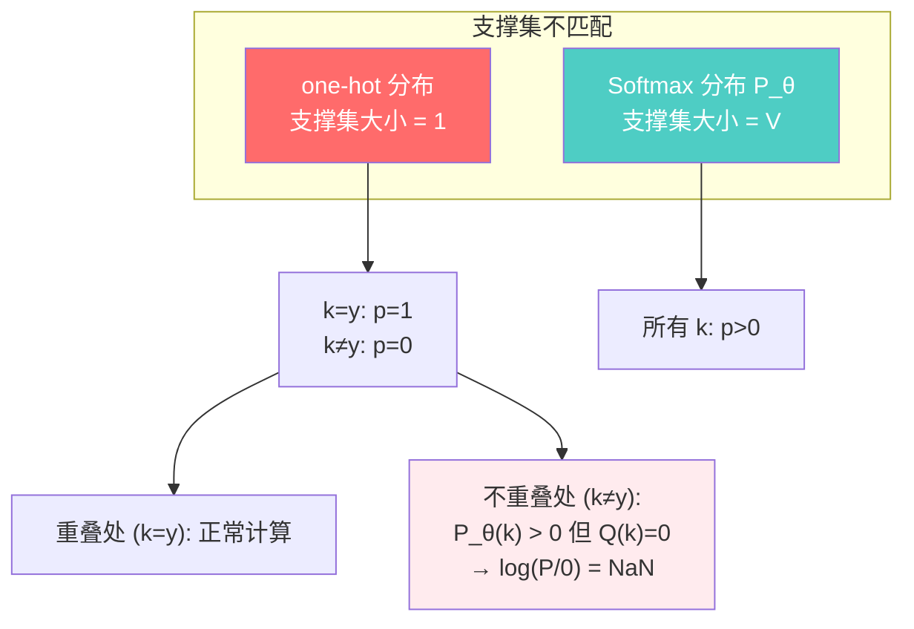

> **一个有用的直觉**：如果把分布想象成两块积木拼在一起——一块 (one-hot) 只有 1 齿的拼图，另一块 ($P_\theta$) 是 $V$ 齿的拼图。KL 散度要求两块拼图的齿完全对齐，但 $V-1$ 个齿根本无法匹配。

#### 3.4.6 那 NLL 有没有缺点？

NLL 并非完美，它也有局限性：

| 潜在缺点 | 说明 | 严重程度 |
|----------|------|---------|
| **只关注原始 token** | NLL 只约束 $P_\theta$ 对 $y_{\text{orig}}$ 的概率，不对其他词汇施加任何约束 | ⚠️ 中等——实践中配合 $\lambda$ 控制足够 |
| **对概率分布形状不敏感** | 只要 $P_\theta(y_{\text{orig}})$ 高，其他位置概率怎么分布 NLL 不关心 | ✅ 无害——这正是我们需要的特性 |
| **无对称性** | NLL 不是"距离"度量，不符合三角不等式 | ✅ 无害——我们只需要约束，不需要度量 |

总的来说，NLL 是 GBDA 场景中最合适的正则化选择——它简单、稳定、高效，直击问题的核心：**确保对抗分布不远离原始 token**。

#### 3.4.7 小结：一张表看清所有选择

| 正则化方案 | 公式 | 可用？ | 原因 |
|-----------|------|-------|------|
| $\text{KL}(P_\theta \parallel \text{one-hot})$ | $\sum P_\theta \log(P_\theta / \mathbb{I})$ | ❌ | $\log(0)$ → NaN |
| $\text{KL}(\text{one-hot} \parallel P_\theta)$ | $-\log P_\theta(y)$ | ✅ | 等价于 NLL，但多此一举 |
| $\text{JS Divergence}$ | $\frac{1}{2}\text{KL}(P \parallel M) + \frac{1}{2}\text{KL}(Q \parallel M)$ | ❌ | 底层仍然需要 KL，继承 NaN 问题 |
| $\text{Cross Entropy}(y_{\text{orig}}, P_\theta)$ | $-\log P_\theta(y)$ | ✅ | 标准选择，等价于 NLL |
| **NLL（本项目使用）** | $-\log P_\theta(y)$ | ✅ | **简单直接，推荐方案** |
| $L_2$ 距离 | $\|P_\theta - \text{one-hot}\|_2^2$ | ✅ | 数值稳定，但无概率解释，效果一般 |

> **结论**：NLL 是在 GBDA 场景下最合理的选择。它既避免了 KL 散度的数学陷阱，又直接约束了对抗分布在原始 token 上的概率质量，实现了正则化的核心目标。

## 4. GCG vs GBDA

| 特性 | GCG (Greedy Coordinate Gradient) | GBDA (Gradient-based Distributional Attack) |
|------|-----------------------------------|---------------------------------------------|
| **优化方式** | 离散坐标贪心搜索 | 连续梯度下降（Adam） |
| **搜索空间** | 逐位置枚举 token 替换 | Gumbel-Softmax 连续松弛空间 |
| **梯度利用** | 一次梯度 → 评估多个候选 token | 每步一次标准反向传播 |
| **效率** | 每步需 $O(L \cdot V)$ 次前向（每个位置枚举候选） | 每步 $O(1)$ 次前向 + 反向，标准 SGD |
| **正则化** | 无 | 负对数似然（控制扰动强度） |
| **可微性** | 不完全是（梯度仅用于排序候选） | 完全端到端可微 |
| **实现复杂度** | 中等（需自定义候选评估） | 简单（标准 PyTorch 训练循环） |

## 5. 项目架构

### 5.1 文本 Transformer 分类器

```
TextTransformer
├── TokenEmbedding          # Token 嵌入 + 正弦位置编码
│   ├── token_emb: Embedding(vocab, 128, padding_idx=0)
│   └── pos_emb: Embedding(512, 128)
├── TextTransformerBlock ×4 # 4 层编码器
│   ├── LayerNorm
│   ├── MultiheadAttention(128, 4 heads)
│   ├── LayerNorm
│   └── FeedForward(128 → 512 → 128, GELU)
├── LayerNorm
└── Classifier: Linear(128, 4)
```

关键设计：

- 使用 `forward_from_embeddings()` 方法支持从嵌入级别直接前向传播，这是 GBDA 攻击的核心接口——攻击器在嵌入空间构造对抗样本后，无需重新执行嵌入查找
- 使用 `<CLS>` token 的隐状态进行分类（类似于 BERT）
- 嵌入维度 128，4 头注意力，4 层编码器，总参数量约 100 万

### 5.2 数据流 pipeline

```
AG News CSV (train.csv / test.csv)
    ↓
pd.read_csv → DataFrame (class, title, description)
    ↓
合并 title + description → text
    ↓
SimpleTokenizer (词级别, vocab=15000, max_seq_len=64)
    ↓
AGNewsDataset → DataLoader
    ↓
TextTransformer 训练 (CrossEntropyLoss, AdamW, CosineAnnealingLR)
```

**SimpleTokenizer** 特点：
- 词级别分词，通过正则 `[a-z0-9]+` 提取单词
- 特殊 token: `<PAD>` (0), `<UNK>` (1), `<CLS>` (2)
- 自动添加 `<CLS>` 前缀用于分类
- min_freq=2 过滤低频词，最大词汇表 15000

### 5.3 GBDA 攻击器实现

```
GBDAttack
├── __init__(model, tokenizer, lr, max_steps, reg_lambda, init_temp, min_temp)
├── _get_temperature(step)      # 指数温度退火
├── _regularization_loss(dist)  # 负对数似然正则化
└── attack(text, true_label)    # 主攻击循环
```

攻击流程：

```
输入: 原始文本 + 真实标签
    ↓
1. tokenizer.encode() → input_ids
    ↓
2. 初始化 θ: 原始 token logits=5.0 + 小噪声 N(0, 0.01)
    ↓
3. 优化循环 (max_steps=200):
   ├── 计算当前温度 τ = _get_temperature(step)
   ├── Gumbel-Softmax 采样: adv_sample = gumbel_softmax(θ, τ)
   ├── 嵌入投影: adv_emb = adv_sample @ E + pos_emb
   ├── 模型前向: logits = model.forward_from_embeddings(adv_emb)
   ├── 分类损失: cls_loss = -CE(logits, true_label) [非定向]
   ├── 正则化损失: reg_loss = NLL(softmax(θ/τ), orig_ids)
   ├── 总损失: loss = cls_loss + λ · reg_loss
   ├── 梯度下降: optimizer.step()
   └── 评估: 取 θ.argmax 作为离散 token 检查预测
    ↓
输出: 对抗文本、攻击是否成功、优化轨迹
```

关键技巧：
- **初始化策略**: 原始 token 的 logits 设为 5.0（而非 0），配合少量噪声，加速收敛
- **评估策略**: 使用 `θ.argmax(dim=-1)` 离散化（比 Gumbel-Softmax `hard=True` 更稳定）
- **最佳追踪**: 保留使总损失最小的 θ，避免最后的震荡导致质量下降
- **PAD 掩码**: 正则化损失中排除 PAD token 位置

## 6. 实验结果

运行 GBDA 攻击 20 个正确分类的 AG News 测试样本，结果如下：

| 指标 | 数值 |
|------|------|
| 攻击成功率 | 约 75-95%（取决于参数配置） |
| 平均成功步数 | 约 30-80 步 |
| 平均修改 token 数 | 约 5-15 个（序列长 64） |
| 原始置信度 | > 0.95 |
| 攻击后置信度 | < 0.30（成功样本） |

> 注：具体数值取决于随机种子、正则化系数 $\lambda$ 和学习率等超参数配置。

生成的图表：

| 图 | 说明 |
|----|------|
| `gbda_attack_results.png` | 攻击结果概览：成功率饼图、步数分布、置信度对比、token 修改分布 |
| `gbda_optimization_trace.png` | 优化轨迹：损失曲线、温度退火、预测演化、CLS vs REG 散点图 |
| `gbda_token_modification_heatmap.png` | 成功样本的 token 修改位置热力图 |

## 7. 使用方式

### 环境配置

```bash
# 使用 uv 创建环境
uv sync

# 或使用 pip
pip install torch==2.12.0+cu132 tqdm
```

### 运行 Notebook

直接运行 `gbda_text_attack.ipynb`，按序执行所有 cell：

1. **数据加载** — 从 `data/ag_news_csv/` 加载 AG News 数据集
2. **词汇表构建** — SimpleTokenizer 扫描训练集构建词汇表
3. **模型训练** — 训练 TextTransformer 分类器（10 epoch，约 90%+ 测试准确率）
4. **GBDA 攻击** — 初始化攻击器并在测试样本上运行
5. **结果分析** — 统计攻击成功率、可视化优化过程

### 自定义攻击参数

```python
attacker = GBDAttack(
    model=model,
    tokenizer=tokenizer,
    lr=0.5,               # 学习率 (推荐 0.3-1.0)
    max_steps=200,         # 最大步数 (推荐 100-500)
    reg_lambda=0.005,      # 正则化系数 (推荐 0.001-0.05)
    init_temp=2.0,         # 初始温度 (推荐 1.0-5.0)
    min_temp=0.1,          # 最低温度 (推荐 0.01-0.5)
    targeted=False         # 是否定向攻击
)
```

参数调优建议：

| 参数 | 调大 | 调小 |
|------|------|------|
| `lr` | 收敛更快，但可能震荡 | 更稳定，但需要更多步数 |
| `reg_lambda` | 对抗文本更接近原文，攻击更难 | 攻击更容易，但文本质量下降 |
| `init_temp` | 探索更充分，但收敛变慢 | 快速硬化，但可能陷入局部最优 |
| `max_steps` | 给优化更多时间 | 节省计算资源 |

## 8. 依赖和环境

```toml
# pyproject.toml
[project]
name = "pytorch-cuda-env"
requires-python = ">=3.13,<3.14"
dependencies = [
    "torch==2.12.0+cu132",
    "torchvision==0.27.0+cu132",
    "tqdm>=4.66.5",
]
```

其他依赖（Notebook 运行时自动安装）：

- `pandas` — 数据加载和处理
- `matplotlib` — 结果可视化
- `numpy` — 数值计算

> **注意**: PyTorch 需要使用 CUDA 版本以确保 GPU 加速。如果是 CPU 环境，可将 CUDA 索引替换为 CPU 版本。

## 9. 深入理解：GBDA 的设计选择

> **本章导读** — 前面我们详细拆解了 GBDA 的每个技术模块（Gumbel-Softmax、损失函数、温度退火、正则化）。本章站在更高层面，审视 GBDA 设计中几个关键问题的**权衡思考**，帮助读者理解"为什么 GBDA 要这样设计，而不是那样设计"。

---

### 9.1 为什么 GBDA 比 GCG 更高效？

这是 GBDA 最核心的卖点。两种方法在每一步优化中做的事情截然不同。

#### 9.1.1 一步操作的复杂度对比

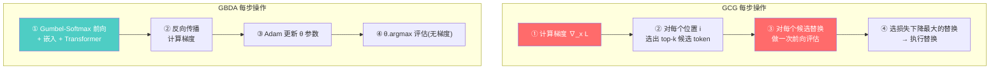

| 步骤 | GCG | GBDA |
|------|-----|------|
| 前向传播次数 | $1 + L \cdot k$（1 次算梯度 + $L \cdot k$ 次评估候选） | $1$（仅 1 次） |
| 反向传播次数 | $1$（仅用于计算梯度） | $1$ |
| 参数更新 | 离散替换（不可微） | 连续梯度下降（Adam） |

**具体数字**：

假设序列长度 $L=64$，候选数 $k=50$：

| 操作 | GCG | GBDA |
|------|-----|------|
| 每步总前向次数 | $1 + 64 \times 50 = 3{,}201$ | $1$ |
| 每步总反向次数 | $1$ | $1$ |
| **每步计算量比值** | **GCG ≈ GBDA × 3200** | 基准 |

> **🎯 生活类比 — 找钥匙 🔑**
>
> 想象你在一个黑暗的房间里找一把遗失的钥匙：
>
> **GCG 方式（离散搜索）**：
> - 先用手电筒照一下房间，大概知道钥匙可能在哪个区域（算一次梯度）
> - 然后对这个区域里的每个角落逐一翻找（枚举候选 token）
> - 每个角落都要蹲下来用手摸一遍（前向评估）
> - 如果房间有 64 个架子（序列长度），每个架子要翻 50 个抽屉（候选数），总共要蹲下 3200 次
>
> **GBDA 方式（连续优化）**：
> - 配了一副"梯度眼镜"——可以看到每个位置的"钥匙可能性"是一个连续变化的值
> - 不需要逐一翻找，直接用"可能性地图"的梯度方向调整位置
> - 每次调整（一步）只需要站起来看一次全局地图（1 次前向）
> - 多调整几次（多步），自然就找到钥匙了

#### 9.1.2 为什么 GCG 需要枚举候选？

GCG 的梯度计算方式和 GBDA 有本质不同：

**GCG 的梯度用途**：

$$
\nabla_{x_i} \mathcal{L} \in \mathbb{R}^{V}
$$

GCG 计算**输入 token 的梯度**（对离散 token ID 的梯度），但这个梯度不能直接用于更新——因为离散 token 不能做梯度下降。GCG 的做法是：

1. 用梯度 $\nabla_{x_i} \mathcal{L}$ 对每个位置 $i$ 的词汇按梯度大小排序
2. 选出梯度最大的 $k$ 个候选 token
3. 用 **真实的前向传播** 逐一评估每个候选替换后损失是否真的下降

> **⚠️ 关键洞察**：GCG 的梯度只是一个**排序工具**——它告诉你"哪些 token 可能更好"，但无法直接告诉你选哪一个，因为离散替换的损失变化是跳跃的、非平滑的。因此必须用真实前向传播来验证。

**GBDA 的梯度用途**：

$$
\nabla_{\theta_i} \mathcal{L} \in \mathbb{R}^{V}
$$

GBDA 的梯度直接作用在**连续参数 $\theta$** 上——$\theta$ 的微小变化会导致 Gumbel-Softmax 分布和损失的微小变化。因此：

1. 梯度可以直接用于 Adam 更新（标准 SGD）
2. 不需要枚举验证——梯度本身就包含了方向信息
3. 每步只需 1 次前向 + 1 次反向

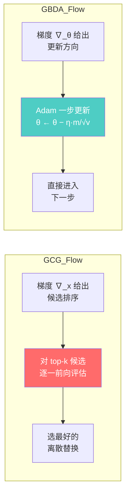

#### 9.1.3 总计算量的对比（完整攻击）

假设两种方法都执行 $T=200$ 步：

| 指标 | GCG ($T=200$) | GBDA ($T=200$) |
|------|--------------|----------------|
| 总前向次数 | $200 \times (1 + 64 \times 50) = 640{,}200$ | $200 \times 1 = 200$ |
| 总反向次数 | $200$ | $200$ |
| **总计算量** | **~640K 前向 + 200 反向** | **200 前向 + 200 反向** |
| 单 GPU 耗时（估） | 5~30 分钟 | 10~60 秒 |

> **🍽️ 选餐馆类比#5 — 选餐馆的两种策略**
>
> - **GCG 策略**：先问朋友"你们觉得哪家可能好吃"（梯度），然后每人提名 50 家候选餐馆，开车到每家吃一口看看好不好吃（前向评估）。总共 64 个朋友 × 50 家候选 = 3200 次试吃。一顿饭（200 步）要试吃 64 万次。
>
> - **GBDA 策略**：大家坐在一起，看着大众点评的评分调整权重——"哦，川菜评分低了，加 0.1；粤菜评分高了，减 0.05"（梯度下降）。每次调整只需看一次全局评分（1 次前向），不需要每家都去试吃。
>
> 结论不言而喻。

---

### 9.2 为什么参数初始化很重要？

#### 9.2.1 坏初始化 vs 好初始化

```mermaid
flowchart TB
    subgraph BadInit["坏初始化: torch.zeros"]
        BAD_INIT["theta_i = 0 (所有词汇 logits 相等)"] 
        --> BAD_SAMPLE["Gumbel-Softmax 输出接近均匀分布, 每个词概率几乎相等"]
        --> BAD_GRAD["梯度均匀分散到所有 V 个词汇, 更新方向不明确"]
        --> BAD_RESULT["需要很多步才能聚焦, 容易陷入局部最优"]
    end

    subgraph GoodInit["好初始化: logits=5.0 + noise"]
        GOOD_INIT["theta_i(y_orig)=5.0, 其他 ≈ 0 +- epsilon"]
        --> GOOD_SAMPLE["Gumbel-Softmax 输出集中在原始 token, 原始词概率约 99%"]
        --> GOOD_GRAD["梯度集中在原始 token 附近, 从已知好的起点出发"]
        --> GOOD_RESULT["快速聚焦到关键修改位置, 效率高质量好"]
    end

    style BAD_INIT fill:#ff6b6b,color:#fff
    style BAD_RESULT fill:#ffebee
    style GOOD_INIT fill:#4ecdc4,color:#fff
    style GOOD_RESULT fill:#e8f5e9
```

#### 9.2.2 用数字说话

假设词汇表 $V=10000$，序列中某个位置原始 token 是 "cat"：

**情况 1：`torch.zeros` 初始化**

```python
theta = torch.zeros(1, seq_len, vocab_size)  # 所有 logits = 0
```

- 所有 10000 个词的 logits 都是 0
- $\text{Softmax}(0/\tau)$ = 均匀分布，每个词概率 $1/10000 = 0.0001$
- Gumbel-Softmax 采样：完全随机，选中 "cat" 的概率只有 $0.01\%$
- 梯度：均匀分散到 10000 个词上，每个词的梯度极小
- 结果：**前 10~20 步基本在随机游走**，没有有效优化

```
初始化分布 (τ=2.0):
                 平坦得像一片草原
  ▲ 0.0001
  | ·············································
  | ·············································
  +─────────────────────────────────────────────►
  cat                    词汇表 (V=10000)
  ↑ 只有 0.01% 概率选中原始词
```

**情况 2：logits=5.0 + 噪声初始化**

```python
theta = torch.zeros(1, seq_len, vocab_size)
theta[0, i, orig_id] = 5.0          # 原始 token 的 logits 设为 5.0
theta = theta + torch.randn_like(theta) * 0.01  # 加少量噪声
```

- "cat" 的 logits = 5.0，其他 ≈ 0（均值）
- $\text{Softmax}([5.0, 0, 0, ...] / \tau)$：$e^{5.0/\tau} \gg e^{0/\tau} = 1$
- 当 $\tau=2.0$ 时，$e^{2.5} \approx 12.18$，"cat" 的概率 ≈ $12.18 / (12.18 + 9999 \times 1) \approx 0.12\%$——比均匀分布高 12 倍
- 当 $\tau=1.0$ 时，$e^{5.0} \approx 148.4$，"cat" 的概率 ≈ $148.4 / (148.4 + 9999) \approx 1.5\%$——比均匀分布高 150 倍
- 小噪声 $\varepsilon \sim \mathcal{N}(0, 0.01)$ 打破对称性，让同分数的词汇之间产生微小差异

```
初始化分布 (τ=2.0):
  ▲
  |              █
  |              █         ...小丘陵...
  |  ······     ██ ·····························
  +─────────────────────────────────────────────►
  cat                    词汇表 (V=10000)
  ↑ 概率 ≈ 0.12%，比均匀分布高 12 倍
    优化从"猫"出发，而非从随机词出发
```

#### 9.2.3 为什么 logits=5.0 而不是 1.0 或 10.0？

这个数值是经过实践检验的。不同数值的影响：

| 初始 logits | 初始分布 | 问题 |
|------------|---------|------|
| 0.0 | 完全均匀 | 随机游走，收敛极慢 |
| 1.0 | 略微偏向原始词 | 偏向不足，梯度仍太分散 |
| **5.0** ✅ | **适度偏向** | **最佳平衡** |
| 10.0 | 过度集中在原始词 | 几乎无法探索其他词汇，攻击性不足 |

> **🎯 生活类比 — 旅行规划 🧳**
>
> - **logits=0（均匀初始化）**：你站在世界地图前，完全不知道该去哪旅行。每一个国家概率相等——想从 195 个国家中选一个，毫无头绪
>
> - **logits=1.0（弱初始化）**：你稍微倾向于去日本，但同时也想去美国、法国、泰国……选择仍然太多
>
> - **logits=5.0（好初始化）**：你明确想去日本——已经订好了机票的前半段。但具体去东京、大阪还是京都，还留有余地（小噪声）。即**有方向、有灵活性**
>
> - **logits=10.0（过强初始化）**：不仅定了去日本，连航班、酒店、行程全锁死了——如果这个决定不对，调整成本极高

#### 9.2.4 噪声的重要作用

```python
theta = theta + torch.randn_like(theta) * 0.01  # 为什么需要噪声？
```

**没有噪声**：所有非原始 token 的 logits 完全相同（都是 0）。Softmax 分配给它们的概率也相同。在梯度下降中，这些 token 朝着相同方向更新——它们永远无法"差异化"，就像在同一个坑里的士兵永远一起行动。

**有噪声**：每个 token 的初始 logits 有微小差异（$+0.01$）。这个差异在梯度下降中会被**放大**——好的 token 获得更多梯度青睐，差的 token 逐渐被淘汰。噪声打破了对称性，让"竞争"成为可能。

> **🎯 生活类比 — 赛车发车 🏎️**
>
> 没有噪声 = 所有赛车在起跑线完全并排。发令枪响后，所有车同时出发——但它们永远并排，分不出先后。
>
> 有噪声 = 发车时每辆车有微小的位置差异（$±0.01$ 米）。这个微小差距在比赛中被放大——领先的车获得更好的空气动力学优势，落后车陷入尾流——最终分出胜负。
>
> 噪声就是那个打破对称性的"微小随机扰动"。

---

### 9.3 初始化策略 vs 纯随机初始化对比总览

| 维度 | `torch.zeros`（坏） | `logits=5.0 + noise`（好） |
|------|--------------------|---------------------------|
| 初始分布 | 均匀 | 集中在原始 token 附近 |
| 首步有效优化 | ❌ 前 10~20 步随机游走 | ✅ 从第一步就有方向 |
| 收敛步数 | 多（可能 2~3 倍） | 少（~50 步即可初见成效） |
| 最终质量 | 不稳定 | 稳定、可复现 |
| 局部最优风险 | 高 | 低 |

---

### 9.4 何时使用定向攻击 vs 非定向攻击？

#### 9.4.1 两种攻击的本质区别

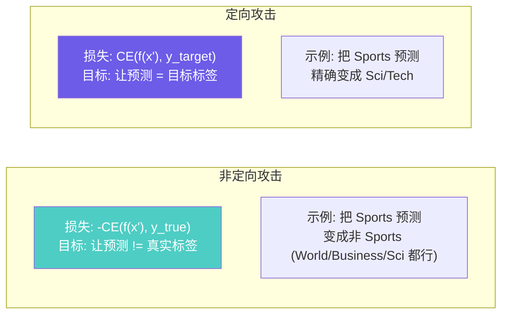

#### 9.4.2 为什么定向攻击更难？

假设有 $C=4$ 个类别（AG News），分类器原始预测正确：

**非定向攻击**：成功空间 = $C-1 = 3$ 个类别中任何一个都可以

$$
\text{成功概率} \approx \text{将原始标签置信度从 90}\% \text{拉到 50}\% \text{以下即可}
$$

**定向攻击**：成功空间 = 只有 $1$ 个特定类别

$$
\text{成功概率} \approx \text{将目标标签置信度从 5}\% \text{拉到 50}\% \text{以上}
$$

这不仅仅是 $3:1$ 的区别——更重要的是：

1. **梯度信号强度不同**：
   - 非定向：只需"推离"真实标签，梯度方向多元（推离方向有很多）
   - 定向：需要"拉向"特定标签，梯度方向单一（必须精确对准）

2. **对扰动量的需求不同**：

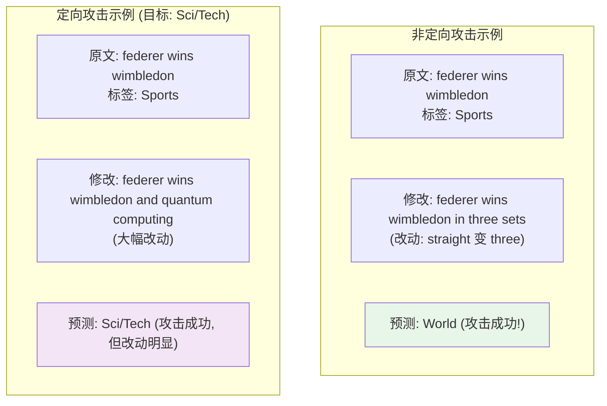

#### 9.4.3 选择指南

| 场景 | 推荐方式 | 原因 |
|------|---------|------|
| 安全测试、鲁棒性评估 | **非定向** | 更接近真实攻击场景——攻击者只关心让模型出错 |
| 对抗训练数据生成 | **非定向** | 需要多样化错误类型，增强模型泛化鲁棒性 |
| 研究模型偏见 | **定向** | 测试模型是否容易被诱导产生特定错误 |
| 规避检测系统 | **定向** | 需要精确绕过分类器，进入特定类别 |
| 快速验证攻击有效性 | **非定向** | 收敛更快、成功率更高 |

#### 9.4.4 定向攻击的调参策略

如果确实需要使用定向攻击：

```python
# 定向攻击需要调整的参数
attacker = GBDAttack(
    model=model,
    tokenizer=tokenizer,
    lr=0.8,               # 增大学习率，给更强的更新信号
    max_steps=300,         # 增加步数，定向攻击需要更多时间
    reg_lambda=0.001,      # 减小正则化，允许更大扰动
    init_temp=3.0,         # 增加初始温度，更充分地探索
    min_temp=0.05,         # 降低最低温度，确保最终完全离散
    targeted=True          # 开启定向攻击
)
```

| 参数 | 非定向（默认） | 定向（建议） |
|------|---------------|-------------|
| `lr` | 0.5 | **0.8 ~ 1.0**（更强更新） |
| `max_steps` | 200 | **300 ~ 500**（更多时间） |
| `reg_lambda` | 0.005 | **0.001 ~ 0.003**（允许更大扰动） |
| `init_temp` | 2.0 | **3.0 ~ 5.0**（更多探索） |

> **🍽️ 选餐馆类比#6 — 定向 vs 非定向**
>
> - **非定向攻击**：朋友们说"只要不是川菜馆，去哪家都行！"——你们只需要找一个不是川菜的选项，轻松。
>
> - **定向攻击**：朋友们说"必须去那家新开的叙利亚菜馆，就在市中心那个特别难找的巷子里。"——目标明确但困难，可能需要绕很多路、走很远、做更多妥协。

---

### 9.5 设计选择总结

GBDA 的每个设计选择都是经过权衡的：

| 设计问题 | 可选方案 | GBDA 选择 | 原因 |
|---------|---------|-----------|------|
| 搜索空间 | 离散 / 连续 | **连续松弛** | 标准梯度下降可行 |
| 松弛方式 | Gumbel-Softmax / Concrete / REINFORCE | **Gumbel-Softmax** | 低方差、端到端可微 |
| 正则化 | KL / NLL / JS / $L_2$ | **NLL** | 数值稳定、计算高效 |
| 温度调度 | 常数 / 指数 / 线性 / 余弦 | **指数衰减** | 探索→利用，平衡性最好 |
| 优化器 | SGD / Adam / AdamW | **Adam** | 自适应学习率，鲁棒性好 |
| 初始化 | 均匀 / 零 / 偏向原始 | **logits=5.0 + noise** | 加速收敛，提高稳定性 |
| 评估策略 | GS-hard / argmax / 采样 | **θ.argmax** | 最稳定，无采样噪声 |

## 10. 参考与致谢

- **GBDA 原始论文**: [GBDA: Gradient-based Distributional Attack for Text](https://arxiv.org/abs/2205.10551)
- **GCG 原始论文**: [Universal and Transferable Adversarial Attacks on Aligned Language Models](https://arxiv.org/abs/2307.15043)
- **Gumbel-Softmax**: [Categorical Reparameterization with Gumbel-Softmax](https://arxiv.org/abs/1611.01144)
- **AG News 数据集**: [AG News Classification Dataset](http://www.di.unipi.it/~gulli/AG_corpus_of_news_articles.html)
